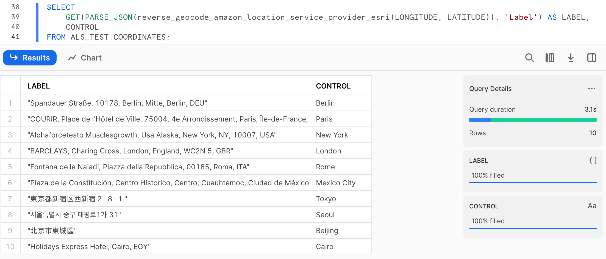

# Amazon Location Service with Snowflake

This repository contains a reference CDK stack that demonstrates how to create an integration between [Amazon Location Service](https://aws.amazon.com/location/) and [Snowflake](https://www.snowflake.com/). The integration is implemented using a set of custom [Snowflake external functions](https://docs.snowflake.com/en/sql-reference/external-functions-introduction.html) that call the [Amazon Location Service API](https://docs.aws.amazon.com/location/latest/developerguide/what-is.html) via a [Snowflake API integration](https://docs.snowflake.com/en/user-guide/api-integration-intro.html) proxied through [AWS API Gateway](https://aws.amazon.com/api-gateway/).

## Architecture


The architecture is composed of the following components:
- A Snowflake database and warehouse
- An Amazon API Gateway endpoint that proxies request to your AWS account and invokes the AWS Lambda function
- One AWS Lambda functions that create the Snowflake resources
- A set of Amazon Location Service place indexes to geocode and reverse geocode addresses
- A set of AWS AppConfig configurations to store the Amazon Location Service place indexes and the Snowflake database and warehouse names
- An AWS Secrets Manager secret to store the Snowflake credentials

> **Note**
> This architecture will create resources that will incur costs. Please refer to the [AWS Pricing](https://aws.amazon.com/pricing/) page for details and ensure you understand the costs before deploying this stack. Additionally, be aware that a trusted relationship is created between the Snowflake account and the AWS account. This means that any user in the Snowflake account will be able to access the AWS account. Please refer to the [Snowflake documentation](https://docs.snowflake.com/en/sql-reference/external-functions-creating-aws-planning) for more information and consider consulting your security team before deploying this stack.

## Geocoding and Reverse Geocoding with Amazon Location Service

### Terminology

**Geocoding** is a process that converts text, such as an address, a region, a business name, or point of interest, into a set of geographic coordinates. You can use place index resources to submit geocoding requests and incorporate data retrieved from geocoding to display data on a map for your web or mobile application.

**Reverse geocoding** is instead a process that converts a set of coordinates into meaningful text, such as an address, a region, a business name, or point of interest. You can use place index resources to submit reverse geocoding requests and incorporate data retrieved from reverse geocoding to display data on a map for your web or mobile application.

To learn more about geocoding and reverse geocoding, refer to the [Amazon Location Service documentation](https://docs.aws.amazon.com/location/latest/developerguide/how-it-works.html).

### External functions available

The stack creates a set of Snowflake external functions that call the Amazon Location Service API. The functions are implemented in JavaScript and are deployed in an AWS Lambda function. The functions are then registered as external functions in Snowflake.

The following external functions are created:
- `reverse_geocode_amazon_location_service_provider_here(lng FLOAT, lat FLOAT)`: Reverse geocodes a set of coordinates (`longitude`, `latitude`) using the [Amazon Location Service HERE provider](https://docs.aws.amazon.com/location/latest/developerguide/HERE.html)
- `geocode_amazon_location_service_provider_here(address VARCHAR)`: Geocodes an address using the [Amazon Location Service HERE provider](https://docs.aws.amazon.com/location/latest/developerguide/HERE.html)
- `reverse_geocode_amazon_location_service_provider_esri(lng FLOAT, lat FLOAT)`: Reverse geocodes a set of coordinates (`longitude`, `latitude`) using the [Amazon Location Service Esri provider](https://docs.aws.amazon.com/location/latest/developerguide/esri.html)
- `geocode_amazon_location_service_provider_esri(address VARCHAR)`: Geocodes an address using the [Amazon Location Service Esri provider](https://docs.aws.amazon.com/location/latest/developerguide/esri.html)
- `reverse_geocode_amazon_location_service_provider_grab(lng FLOAT, lat FLOAT)`: Reverse geocodes a set of coordinates (`longitude`, `latitude`) using the [Amazon Location Service Grab provider](https://docs.aws.amazon.com/location/latest/developerguide/grab.html) - **Note**: This function is only available when deploying the stack in the `ap-southeast-1` (Singapore) region
- `geocode_amazon_location_service_provider_grab(address VARCHAR)`: Geocodes an address using the [Amazon Location Service Grab provider](https://docs.aws.amazon.com/location/latest/developerguide/grab.html) - **Note**: This function is only available when deploying the stack in the `ap-southeast-1` (Singapore) region

All the functions return a [`VARIANT` type](https://docs.snowflake.com/en/sql-reference/data-types-semistructured#variant) that contains the JSON response from the Amazon Location Service API.

### How to use the external functions

#### Reverse Geocoding

To reverse geocode a set of coordinates, you can use the `reverse_geocode_amazon_location_service_provider_here(lng FLOAT, lat FLOAT)` function, or any of the other functions that use a different provider.

For instance, to reverse geocode the coordinates `13.404954,52.520008` (Berlin, Germany), you can use the following query:

```sql
SELECT reverse_geocode_amazon_location_service_provider_esri(13.404954, 52.520008) AS RAW_RESPONSE;
```

The result of this query is a JSON string:

| RAW_RESPONSE                                                                                                                                                                                                                                                                         |
| ------------------------------------------------------------------------------------------------------------------------------------------------------------------------------------------------------------------------------------------------------------------------------------ |
| "{\"Country\":\"DEU\",\"Geometry\":{\"Point\":[13.404963148341725,52.52001976137106]},\"Interpolated\":false,\"Label\":\"Spandauer Straße, 10178, Berlin, Mitte, Berlin, DEU\",\"Municipality\":\"Berlin\",\"PostalCode\":\"10178\",\"Region\":\"Berlin\",\"SubRegion\":\"Berlin\"}" |


If you want to access a specific field from the response, you can use the `GET` function in combination with the `PARSE_JSON` function. For instance, to get the `Country`, `Municipality`, and `Label` fields from the response, you can use the following query:

```sql
SELECT 
  GET(PARSE_JSON(reverse_geocode_amazon_location_service_provider_esri(13.404954, 52.520008)), 'Country') AS COUNTRY,
  GET(PARSE_JSON(reverse_geocode_amazon_location_service_provider_esri(13.404954, 52.520008)), 'Municipality') AS MUNICIPALITY,
  GET(PARSE_JSON(reverse_geocode_amazon_location_service_provider_esri(13.404954, 52.520008)), 'Label') AS LABEL
```

which returns the following result:

| COUNTRY | MUNICIPALITY | LABEL                                               |
| ------- | ------------ | --------------------------------------------------- |
| DEU     | Berlin       | Spandauer Straße, 10178, Berlin, Mitte, Berlin, DEU |


For a full list of the fields returned by the Amazon Location Service API, refer to the [Amazon Location Service API Reference](https://docs.aws.amazon.com/location/latest/APIReference/API_SearchPlaceIndexForPosition.html#API_SearchPlaceIndexForPosition_ResponseSyntax).

#### Geocoding

To geocode an address, you can use the `geocode_amazon_location_service_provider_here(address VARCHAR)` function, or any of the other functions that use a different provider.

For instance, to geocode the address `1600 Pennsylvania Ave NW, Washington, DC 20500, USA`, you can use the following query:

```sql
SELECT geocode_amazon_location_service_provider_esri('1600 Pennsylvania Ave NW, Washington, DC 20500, USA') AS RAW_RESPONSE;
```

The result of this query is a JSON string:

| RAW_RESPONSE
| ------------------------------------------------------------------------------------------------------------------------------
| "{\"longitude\":-77.03654699820865,\"latitude\":38.89767510765125}"


If you want to access a specific field from the response, you can use the `GET` function in combination with the `PARSE_JSON` function. For instance, to get the `longitude` and `latitude` fields from the response, you can use the following query:

```sql
SELECT 
  GET(PARSE_JSON(geocode_amazon_location_service_provider_esri('1600 Pennsylvania Ave NW, Washington, DC 20500, USA')), 'longitude') AS LONGITUDE,
  GET(PARSE_JSON(geocode_amazon_location_service_provider_esri('1600 Pennsylvania Ave NW, Washington, DC 20500, USA')), 'latitude') AS LATITUDE;
```

which returns the following result:

| LONGITUDE          | LATITUDE          |
| ------------------ | ----------------- |
| -77.03654699820865 | 38.89767510765125 |


For a full list of the fields returned by the Amazon Location Service API, refer to the [Amazon Location Service API Reference](https://docs.aws.amazon.com/location/latest/APIReference/API_SearchPlaceIndexForText.html#API_SearchPlaceIndexForText_ResponseSyntax).

### How to customize the external functions

The external functions are defined in the `functions/common/snowflake-helpers.ts` file. You can customize the functions by changing the code in this file and re-deploying the stack.

Likewise, if you want to customize the integration with the Amazon Location Service API, you can change the implementation of the `geocodeRows` and `reverseGeocodeRows` functions in the `functions/common/location-helpers.ts` file and re-deploy the stack.

## Getting Started

### Prerequisites

In order to deploy this stack, you will need the following:
- [AWS CDK](https://docs.aws.amazon.com/cdk/latest/guide/getting_started.html) installed and configured
- A [Snowflake](https://www.snowflake.com/) account (sign up for a free trial [here](https://signup.snowflake.com/))
- An AWS account (create one [here](https://aws.amazon.com/premiumsupport/knowledge-center/create-and-activate-aws-account/))
- Node.js 16.x or later install [here](https://nodejs.org/en/download/) or via [nvm]([http](https://github.com/nvm-sh/nvm))/[fnm](https://github.com/Schniz/fnm)

### Prepare the Snowflake environment

In this section, you will create a new Snowflake warehouse and database to host the external functions and API integration. If you already have a Snowflake account, you can skip this section and use an existing database and warehouse.

1. Create a data warehouse

```sql
CREATE WAREHOUSE MY_WAREHOUSE
  WITH WAREHOUSE_SIZE = 'XSMALL'
  WAREHOUSE_TYPE = 'STANDARD'
  AUTO_SUSPEND = 60
  AUTO_RESUME = TRUE
  MIN_CLUSTER_COUNT = 1
  MAX_CLUSTER_COUNT = 3
  SCALING_POLICY = 'ECONOMY'
  INITIALLY_SUSPENDED = TRUE;
```

> **Note**
> Some of the parameters used in the `CREATE WAREHOUSE` statement like `MAX_CLUSTER_*` require a [Snowflake license](https://www.snowflake.com/pricing/). If you are using a trial account, you can remove these parameters from the statement.

1. Create a database and schema

```sql
USE WAREHOUSE MY_WAREHOUSE;
CREATE DATABASE IF NOT EXISTS MY_DATABASE;
CREATE SCHEMA IF NOT EXISTS MY_DATABASE.MY_SCHEMA;
```

Write down the name of the database and warehouse you created. You will need these names later.

### Prepare the AWS environment

> **Note**
> This section assumes that you already have an AWS account and that you have enough permissions to create and manage AWS Secrets Manager secrets. To create a secret, you need the permissions granted by the `SecretsManagerReadWrite` [AWS managed policies](https://docs.aws.amazon.com/secretsmanager/latest/userguide/reference_available-policies.html).

1. Create an AWS Secrets Manager secret

In this section, you will create a new AWS Secrets Manager secret to store the Snowflake credentials. These credentials will be used by the stack to create the Snowflake API integration and external functions in the next section.

Follow the instructions [here](https://docs.aws.amazon.com/secretsmanager/latest/userguide/manage_create-basic-secret.html) to create a new AWS Secrets Manager secret.

The secret should contain the following key-value pairs:
- `account`: The name of your Snowflake account (more info [here](https://docs.snowflake.com/en/user-guide/admin-account-identifier))
- `username`: The username of a Snowflake user with the `CREATE EXTERNAL FUNCTION` and `CREATE INTEGRATION` [privileges](https://docs.snowflake.com/en/sql-reference/sql/create-external-function.html#privileges)
- `password`: The password of the Snowflake user


When creating the secret, make sure to select the `Other type of secrets` option and note the secret name. You will need this name in the next section.

2. Review Amazon Location Service quotas

The stack will create one place index for each provider available in the region you deploy the stack to. These place indexes will be used by the external functions to perform geocoding and reverse geocoding. 

The default [Amazon Location Service quotas](https://docs.aws.amazon.com/location/latest/developerguide/location-quotas.html) implement rate limits for the operations performed by the external functions. The default quotas allow 50 requests per second for both the `SearchPlaceIndexForPosition` and `SearchPlaceIndexForText` operations. Depending on the size of your queries, you might need to increase these limits, you can request a quota increase by following the instructions [here](https://docs.aws.amazon.com/general/latest/gr/aws_service_limits.html).

If you simply follow the instructions in this guide, you should not exceed the default quotas. However, if you plan to use the external functions in a production environment, you should review the default quotas and request a quota increase if necessary.

### Deployment

> **Note**
> Before deploying the stack, make sure to review the Amazon Location Service FAQs [here](https://aws.amazon.com/location/faqs/#General) to make sure that the service is available in your region.

1. Clone this repository

```bash
git clone git@github.com:aws-samples/amazon-location-service-with-snowflake.git
```

2. Install dependencies

```bash
cd amazon-location-service-with-snowflake
npm ci
```

3. Deploy the stack 

In this step, you will deploy the CDK stack to your AWS account. In order to do so, you will need to provide the following parameters:
- `AccountUserPassSecretNameParam` - The name of the AWS Secrets Manager secret that you created in the previous section
- `ApiIntegrationNameParam` - The name of the Snowflake API integration that will be created by the stack, this name must be unique across your Snowflake account
- `SnowflakeWarehouseParam` - The name of the Snowflake warehouse that you created in the previous section
- `SnowflakeDatabaseParam` - The name of the Snowflake database that you created in the previous section
- `SnowflakeSchemaParam` - The name of the Snowflake schema that you created in the previous section

```bash
cd infrastructure
npx cdk deploy --parameters AccountUserPassSecretNameParam=<SECRET_NAME> --parameters ApiIntegrationNameParam=<INTEGRATION_NAME> --parameters SnowflakeWarehouseParam=<WAREHOUSE_NAME> --parameters SnowflakeDatabaseParam=<DATABASE_NAME> --parameters SnowflakeSchemaParam=<SCHEMA_NAME>
```

> **Note**
> The stack will take under 10 minutes to deploy. During this time, please do not close the terminal window. If the deployment fails, check the CloudFormation console for more information.

### Use the external functions

1. Confirm that the API integration and external functions were created successfully

```sql
USE WAREHOUSE MY_WAREHOUSE;
USE DATABASE MY_DATABASE;
SHOW API INTEGRATIONS;
```

and

```sql
USE WAREHOUSE MY_WAREHOUSE;
USE DATABASE MY_DATABASE;
SHOW EXTERNAL FUNCTIONS;
```

1. Create a sample table

```sql
USE WAREHOUSE MY_WAREHOUSE;
USE DATABASE MY_DATABASE;
CREATE OR REPLACE TABLE MY_SCHEMA.COORDINATES (
  ID INTEGER,
  LONGITUDE FLOAT,
  LATITUDE FLOAT,
  ADDRESS VARCHAR(255),
  CONTROL VARCHAR(255)
);
```

1. Insert some sample data

```sql
USE WAREHOUSE MY_WAREHOUSE;
USE DATABASE MY_DATABASE;
INSERT INTO MY_SCHEMA.COORDINATES (ID, LONGITUDE, LATITUDE, CONTROL)
VALUES (1, 13.404954, 52.520008, 'Berlin'),
       (2, 2.352222, 48.856614, 'Paris'),
       (3, -74.005973, 40.712775, 'New York'),
       (4, -0.127758, 51.507351, 'London'),
       (5, 12.496366, 41.902782, 'Rome'),
       (6, -99.133209, 19.432608, 'Mexico City'),
       (7, 139.691706, 35.689487, 'Tokyo'),
       (8, 126.977969, 37.566535, 'Seoul'),
       (9, 116.407395, 39.904211, 'Beijing'),
       (10, 31.235712, 30.044420, 'Cairo');
```

4. Use the external functions

```sql
USE WAREHOUSE MY_WAREHOUSE;
USE DATABASE MY_DATABASE;
SELECT 
    GET(PARSE_JSON(MY_SCHEMA.reverse_geocode_amazon_location_service_provider_esri(LONGITUDE, LATITUDE)), 'Label') AS LABEL,
    CONTROL
FROM MY_SCHEMA.COORDINATES;
```



### Cleanup

To avoid incurring unnecessary charges, you should delete the stack as well as the AWS Secrets Manager secret and Snowflake warehouse and database that you created in the previous sections.

To delete the stack and all of its resources, run the following command and confirm the deletion when prompted:

```bash
cd infrastructure
npx cdk destroy
```

To delete the AWS Secrets Manager secret, follow the instructions [here](https://docs.aws.amazon.com/secretsmanager/latest/userguide/manage_delete-secret.html). Alternatively, you can permanently delete the secret by running the following command:

```bash
aws secretsmanager delete-secret --secret-id <SECRET_NAME> --force-delete-without-recovery
```

To delete the Snowflake warehouse and database, follow the instructions [here](https://docs.snowflake.com/en/sql-reference/sql/drop-warehouse.html) and [here](https://docs.snowflake.com/en/sql-reference/sql/drop-database.html), respectively.

### License

This library is licensed under the MIT-0 License. See the [LICENSE](./LICENSE) file.
